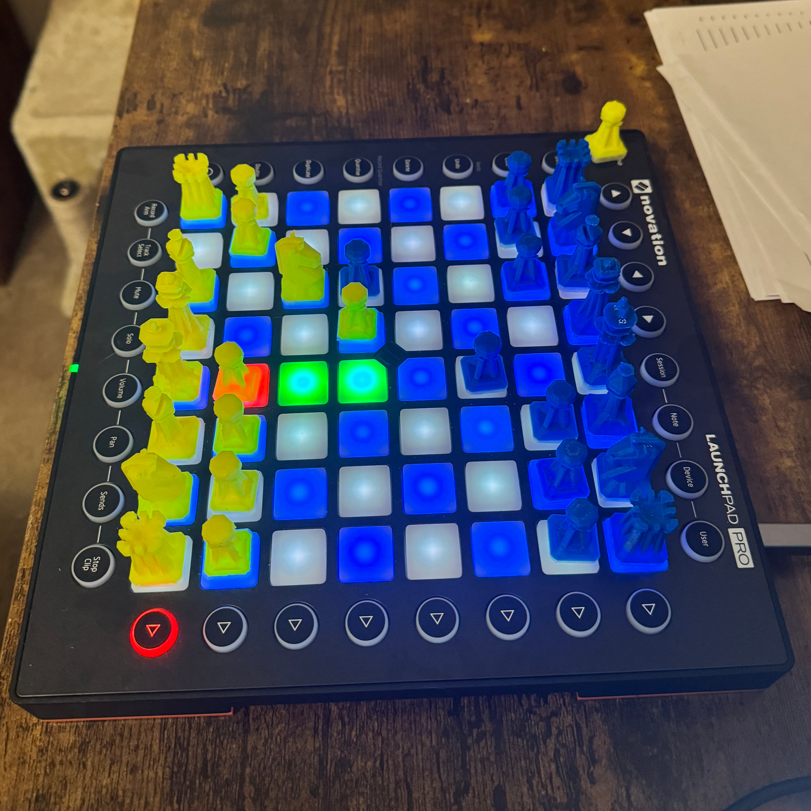

# Launchpad Chess

This python application allows the Novation Launchpad to act as a chess board. After the game, a pgn file is saved to allow for analysis afterwards.



### Usage

Install the requirements:
```
pip install -r requirements.txt
```
Note: On non-intel macs, PyGame 2.6 must be built from source (2.5 will not work correctly)

### Output Directory

Change the location of the saved pgn by updating `OUTPUT_DIR` in `constants.py`